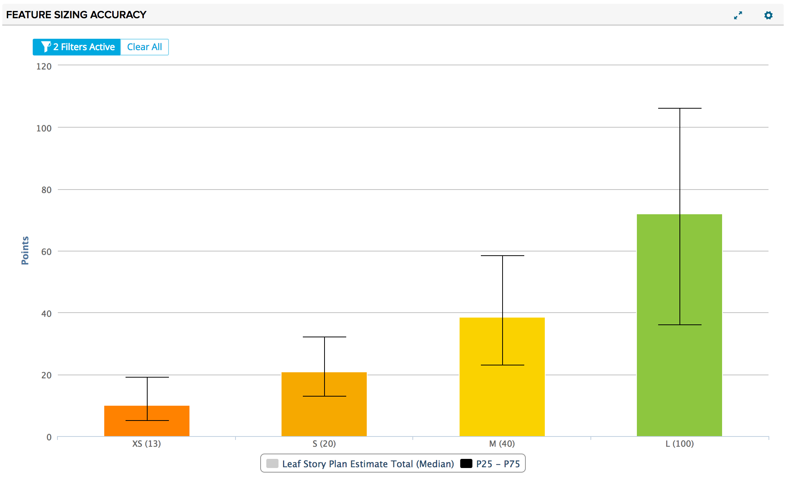
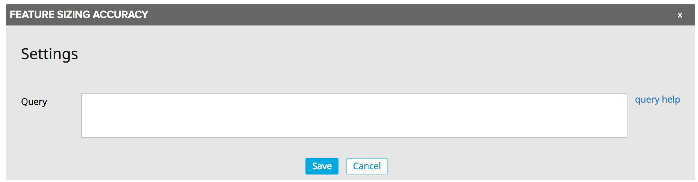

# Feature Sizing Accuracy Chart

This app is designed to be used to evaluate the accuracy of initial feature sizing vs. their final story estimate rollups. The average leaf story plan estimate total is plotted as a column for each available Preliminary Estimate value.  Whiskers are included for the 25th and 75th percentiles. The standard filtering component is also included to enable further slicing and dicing of data.

## Installation and Settings
The app is installed as a Custom HTML App ([see help documentation](https://help.rallydev.com/custom-html))
Once the app is installed, use the gear menu on the app panel and select "Edit App Settings".

#### Query
In addition to the advanced filtering component in the app, you can write your own complex filter queries. [Extensive documentation](https://help.rallydev.com/grid-queries?basehost=https://rally1.rallydev.com) is available. This might be useful if you want to always limit the chart to certain complex criteria.
